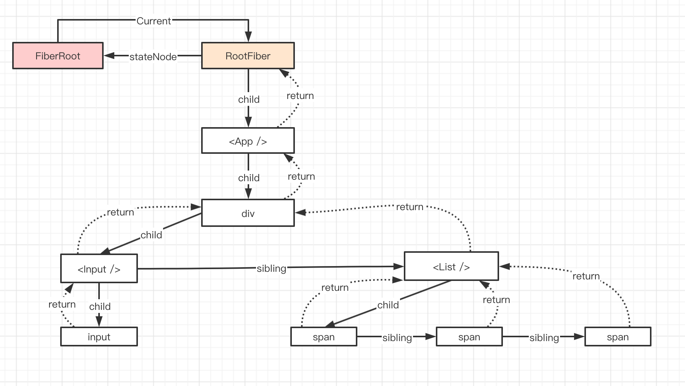

react-code

react源码

##### 参阅地址: https://react.jokcy.me/book/api/react-element.html

- 
  ### 写在前面:
  ##### 1. 重要package:
  
  react, react-dom, event, scheduler, suspense, 
  
  ##### 2. Fiber
  
  Fiber从根本上解决了JS单线程运行如果计算量太大的话导致动画卡帧和交互卡顿的问题
  
  ##### 3. Babel JSX=>JS
  
  Babel会把JSX转化成React.createElement(). 其中第一个参数是字符串或者是大写的变量,第二个参数是由props传递的所有的属性的一个个键值对的对象, 第三个参数是子级.如子级有兄弟节点的话,也会依次转化成第四个,第五个参数,依次类推. 而第一个参数是否为字符串的关键点就在于标签时用大写还是小写.小写代表是原生的html标签(dom节点),大写是代表一个Component (function Component或者是Class Component)
  
  ##### 4. Reserved props 内嵌的props
  
  key, ref, __self, __source
  
  ##### 5. defaultProps
  
  判断依据是这个属性的值是否是undefined

- ### ReactElement和CreateElement的实现过程

```javascript
function createElement(type, config, children) {
  let propName;

  // Reserved names are extracted
  const props = {};

  let key = null;
  let ref = null;
  let self = null;
  let source = null;

  if (config != null) {
    if (hasValidRef(config)) {
      ref = config.ref;

      if (__DEV__) {
        warnIfStringRefCannotBeAutoConverted(config);
      }
    }
    if (hasValidKey(config)) {
      key = '' + config.key;
    }

    self = config.__self === undefined ? null : config.__self;
    source = config.__source === undefined ? null : config.__source;
    // Remaining properties are added to a new props object
    for (propName in config) {
      if (
        hasOwnProperty.call(config, propName) &&
        !RESERVED_PROPS.hasOwnProperty(propName)
      ) {
        props[propName] = config[propName];
      }
    }
  }

  // Children can be more than one argument, and those are transferred onto
  // the newly allocated props object.
  const childrenLength = arguments.length - 2;
  if (childrenLength === 1) {
    props.children = children;
  } else if (childrenLength > 1) {
    const childArray = Array(childrenLength);
    for (let i = 0; i < childrenLength; i++) {
      childArray[i] = arguments[i + 2];
    }
    props.children = childArray;
  }

  // Resolve default props
  if (type && type.defaultProps) {
    const defaultProps = type.defaultProps;
    for (propName in defaultProps) {
      if (props[propName] === undefined) {
        props[propName] = defaultProps[propName];
      }
    }
  }
  return ReactElement(
    type,
    key,
    ref,
    self,
    source,
    ReactCurrentOwner.current,
    props,
  );
}
```

```javascript
const ReactElement = function(type, key, ref, self, source, owner, props) {
    const element = {
        // This tag allows us to uniquely identify this as a React Element
        $$typeof: REACT_ELEMENT_TYPE,

        // Built-in properties that belong on the element
        type: type,
        key: key,
        ref: ref,
        props: props,

        // Record the component responsible for creating this element.
        _owner: owner,
    };
    return element;
};
```

$$typeof 用来标识element是什么类型 REACT_ELEMENT_TYPE或其他

- ### Component和PureComponent

```javascript
function Component(props, context, updater) {
  this.props = props;
  this.context = context;
  // If a component has string refs, we will assign a different object later.
  this.refs = emptyObject;
  // We initialize the default updater but the real one gets injected by the
  // renderer.
  this.updater = updater || ReactNoopUpdateQueue;
}

Component.prototype.setState = function(partialState, callback) {
  invariant(
    typeof partialState === 'object' ||
      typeof partialState === 'function' ||
      partialState == null,
    'setState(...): takes an object of state variables to update or a ' +
      'function which returns an object of state variables.',
  );
  this.updater.enqueueSetState(this, partialState, callback, 'setState');
};
```

PureComponent是继承了Component
```javascript
function ComponentDummy() {}
ComponentDummy.prototype = Component.prototype;

function PureComponent(props, context, updater) {
  this.props = props;
  this.context = context;
  // If a component has string refs, we will assign a different object later.
  this.refs = emptyObject;
  this.updater = updater || ReactNoopUpdateQueue;
}

const pureComponentPrototype = (PureComponent.prototype = new ComponentDummy());
pureComponentPrototype.constructor = PureComponent;
// Avoid an extra prototype jump for these methods.
Object.assign(pureComponentPrototype, Component.prototype);
pureComponentPrototype.isPureReactComponent = true;
```

- ### React Ref

  1. string ref

  2. method ref

  3. **obj ref** . 使用方法: React.createRef();

     ```javascript
     	export function createRef(): RefObject {
        const refObject = {
          current: null,
        };
        return refObject;
      }
     ```

- ### ForwardRef

   适用场景: 在函数组件中(PureComponent), props无法传递ref, 没有实例. 需要forwardRef

   ```javascript
       const Comp = React.forwardRef((props, ref) => {
          return <input type="text" ref={ref} />
       })
   ```

   

    ```javascript
   	 export function forwardRef<Props, ElementType: React$ElementType>(
       render: (props: Props, ref: React$Ref<ElementType>) => React$Node,
        ) {
          const elementType = {
            $$typeof: REACT_FORWARD_REF_TYPE,
            render,
          };
          return elementType;
        }
    ```

​      forwardRef返回的是一个对象,其中$$typeof是REACT_FORWARD_REF_TYPE. 但是组件的类型仍然是  $$typeof是REACT_ELEMENT_TYPE. 只是ReactElement的传值type变成了相应的forward类型.

```javascript
const element = {    
  $$typeof: REACT_ELEMENT_TYPE,    //注意！！！   
  type: {      
    $$typeof: REACT_FORWARD_REF_TYPE,      
    render,    
  },  
};
```

- ### Context

  childContextType(已废弃)

  createContext, useContext

  ```javascript
  const context: ReactContext<T> = {
    $$typeof: REACT_CONTEXT_TYPE,
    _calculateChangedBits: calculateChangedBits,
    _currentValue: defaultValue,
    _currentValue2: defaultValue,
    _threadCount: 0,
    Provider: (null: any),
    Consumer: (null: any),
  };
  ```

- ### ConcurrentMode

  让react的整体渲染过程能够进行优先级的排比并且让整体渲染的过程是能够中断的,可以进行任务的调度,把更多的CPU性能调度给优先级较高的任务, 使得一些耗费大量计算的动画不会渲染的很卡顿.

  <ConcurrentMode></ConcurrentMode>包裹的组件均为低优先级的. 而flushSync会强制执行高优先级的.

- ### Suspense

  1. Suspense包裹的所有组件, 会等待其中所有的promise异步任务均完成, 才会显示包裹的组件,否则展示fallback. 可以支持异步渲染数据
  2. lazy支持异步渲染懒加载组件. 其实在编译的过程中配合webpack生成了一个chunk.js, 其实是code spliting生成出来的.

- ### Memo

  1. 性能优化的点所在. 调用setState会触发组件的重新渲染,无论state是否变化; 父组件更新,子组件也会自动更新.
  2. 在子组件不需要父组件的值和函数的情况下,只需要memo函数; 如果有函数传递给子组件,使用useCallback, 如果是有值传递给子组件使用useMemo.

- ### Others

  1. createFactory: 调用了createElement,并传入的type, 代表什么类型的标签
  2. cloneElement: 其实是创建一个element, 最终是返回ReactElement

- ### ReactDOM.render

  1. 创建更新的三种方式:

     ```javascript
     a. ReactDOM.render || hydrate
     b. setState
     c. forceUpdate
     ```

  2. **legacyRenderSubtreeIntoContainer**(parentComponent, element, containerNode, forceHydrate, callback)

  3. hydrate和render的区别就在于legacyRenderSubtreeIntoContainer的第四个参数forceHydrate是否为true. hydrate是用于服务端渲染的情况下,当客户端第一次渲染的dom节点可以复用的时候,那么可以直接提供给服务端进行渲染,这时候设置为true可以提高性能

  4. createContainer主要是reactReconciler重点, 返回的是createFiberRoot

     > const root = this._internalRoot; 调用的正是createContainer方法, 返回的是一个createFiberRoot. 

     ```javascript
  	  // 代表元素节点
      export const ELEMENT_NODE = 1;
      // 代表文本节点
      export const TEXT_NODE = 3;
      // 代表注释节点
      export const COMMENT_NODE = 8;
      // 代表整个文档，即document
      export const DOCUMENT_NODE = 9;
      // 代表文档片段节点
      export const DOCUMENT_FRAGMENT_NODE = 11;    
     ```

     >根据节点的nodeType是否ElementType和rootElement.hasAttribute(ROOT_ATTRIBUTE_NAME) 其实就是这个属性'data-reactroot'.来判断是否是客户端渲染还是服务端渲染

     ```javascript
     export function createContainer(
        containerInfo: Container,
        tag: RootTag,
        hydrate: boolean,
        hydrationCallbacks: null | SuspenseHydrationCallbacks,
        strictModeLevelOverride: null | number,
      ): OpaqueRoot {
        return createFiberRoot(
          containerInfo,
          tag,
          hydrate,
          hydrationCallbacks,
          strictModeLevelOverride,
        );
      }
     ```

     创建了一个FiberRoot之后, 并在节点上执行updateQueue创建更新队列挂载在fiber.updateQueue下面. 再去根据优先级进行实际的任务的调度更新.

- ### FiberRoot

  是整个应用的起点, 包含应用挂载的的目标节点,记录整个应用更新过程的各种信息

  ```javascript
  function FiberRootNode(containerInfo, tag, hydrate) {
    this.tag = tag;
    this.containerInfo = containerInfo;
    this.pendingChildren = null;
    this.current = null;
    this.pingCache = null;
    this.finishedWork = null;
    this.timeoutHandle = noTimeout;
    this.context = null;
    this.pendingContext = null;
    this.hydrate = hydrate;
    this.callbackNode = null;
    this.callbackPriority = NoLanePriority;
    this.eventTimes = createLaneMap(NoLanes);
    this.expirationTimes = createLaneMap(NoTimestamp);

    this.pendingLanes = NoLanes;
    this.suspendedLanes = NoLanes;
    this.pingedLanes = NoLanes;
    this.expiredLanes = NoLanes;
    this.mutableReadLanes = NoLanes;
    this.finishedLanes = NoLanes;

    this.entangledLanes = NoLanes;
    this.entanglements = createLaneMap(NoLanes);

    if (enableCache) {
      this.pooledCache = null;
      this.pooledCacheLanes = NoLanes;
    }

    if (supportsHydration) {
      this.mutableSourceEagerHydrationData = null;
    }

    if (enableSchedulerTracing) {
      this.interactionThreadID = unstable_getThreadID();
      this.memoizedInteractions = new Set();
      this.pendingInteractionMap = new Map();
    }
    if (enableSuspenseCallback) {
      this.hydrationCallbacks = null;
    }
  }
  ```

- ### Fiber

  1. 每一个ReactElement对应一个Fiber对象. 
  2. 会记录节点的各种状态,包括state和props.对class Component来说每次更新都是挂载在Fiber对象上,并由Fiber去赋值给this. 这样Function Component实现思路也会因此而来,因为Function Component没有this.
  3. 串联整个应用形成树结构: 遍历的过程是深度优先遍历
  ```javascript
  function FiberNode(
    tag: WorkTag,
    pendingProps: mixed,
    key: null | string,
    mode: TypeOfMode,
  ) {
    // Instance
    this.tag = tag;
    this.key = key;
    this.elementType = null;
    this.type = null;
    this.stateNode = null;

    // Fiber
    this.return = null;  // return 是指向自己的父节点
    this.child = null;   // 指向自己的第一个子节点
    this.sibling = null;
    this.index = 0;

    this.ref = null;

    this.pendingProps = pendingProps;
    this.memoizedProps = null;  // 上一次的state
    this.updateQueue = null;    // 新的state
    this.memoizedState = null;
    this.dependencies = null;

    this.mode = mode;

    // Effects
    this.flags = NoFlags;
    this.subtreeFlags = NoFlags;
    this.deletions = null;

    this.lanes = NoLanes;
    this.childLanes = NoLanes;

    this.alternate = null;

    if (enableProfilerTimer) {
      this.actualDuration = Number.NaN;
      this.actualStartTime = Number.NaN;
      this.selfBaseDuration = Number.NaN;
      this.treeBaseDuration = Number.NaN;
      this.actualDuration = 0;
      this.actualStartTime = -1;
      this.selfBaseDuration = 0;
      this.treeBaseDuration = 0;
    }
   }
  ```
  
- ### update和UpdateQueue

  update: 用于记录组件状态的改变, 存放于UpdateQueue中,多个update可以同时存在

  ```javascript
  const update: Update<*> = {
    eventTime,
    lane,

    tag: UpdateState,  // 0|1|2|3
    payload: null,
    callback: null,

    next: null,
  };
  
  export const UpdateState = 0;
  export const ReplaceState = 1;
  export const ForceUpdate = 2;
  export const CaptureUpdate = 3;
  
  export type UpdateQueue<State> = {
    baseState: State,
    firstBaseUpdate: Update<State> | null, // 单向链表的第一个update
    lastBaseUpdate: Update<State> | null,  // 单向链表的最后一个update
    shared: SharedQueue<State>,
    effects: Array<Update<State>> | null,
  };
  ```
  
  执行setState,其实是执行了updater上的enqueueSetState方法:
  
  1. 找到实例上的fiber
  2. 计算得到当前fiber的优先级
  3. 将要更新的fiber推送到更新队列
  4. 根据fiber树上的优先级确定更新工作,从当前fiber的return为起点,开始递归,直到到达根节点,根节点的return为null.
  
- ### ExpirationTime如何计算的?

  以computeAsyncExpiration举例. 

  ```js
  export const LOW_PRIORITY_EXPIRATION = 5000
  export const LOW_PRIORITY_BATCH_SIZE = 250
  ```

  那么计算公式就是: (| 0 是取整的意思)

  >((((currentTime - 2 + 5000 / 10) / 25) | 0) + 1) * 25
  
  expirationTime越小优先级越高, 
  
  1. Sync是代表同步,优先级最高, 不会被调度也不会被打断. 
  
  2. NoWork是0 代表没有更新. 
  3. Async会计算过期时间(InteractiveExpiration是高优先级值更小, AysncExpiration是低优先级值更大). 当setState有回调函数时会走isBatchingInteractiveUpdates为true, 会走InteractiveExpiration高优先级执行
  
  **二进制位运算: & |** 
  
  创建更新的三种方式. 三种方式的执行过程大体相同:
  
  1. ReactDOM.render, 
  
  2. setState(enqueueSetState)
  
  3. forceUpdate(enqueueForceUpdate)
  
  ```javascript
	enqueueSetState(inst, payload, callback) {
	  const fiber = ReactInstanceMap.get(inst);
    const currentTime = requestCurrentTime();
    const expirationTime = computeExpirationForFiber(currentTime, fiber);
  
  const update = createUpdate(expirationTime);
    update.payload = payload;
    if (callback !== undefined && callback !== null) {
      update.callback = callback;
    }
  
  enqueueUpdate(fiber, update);
    scheduleWork(fiber, expirationTime);
  },
  ```

- ### ScheduleWork

  

  
  
   举个简单的例子:
  
  
  点击Button, 去更新List下面的每个span. 其实setState发生在List上. 但是并不是把List节点加入到调度上.而是把这个组件的RootFiber节点加入到调度中
  
  
  
  以下这三点条件(&&且), 就会执行resetStack(). 打断当前的任务,执行更高优先级
  
  1. !isWorking: 没有正在进行渲染的任务
  
  2. nextRenderExpirationTime != noWork: 异步任务正在执行一半的时候没有执行完,要把执行权交给浏览器去执行优先级更高的任务
  
  3. expirationTime < nextRenderExpirationTime: 新的任务的优先级要高于目前做的任务


  以下这三个条件(|| 或),就会执行requestWork().

1. !isWorking: isWorking会包含isCommiting, 是render和commit阶段

2. isCommiting: 正在提交,不可打断的一个阶段. 将Fiber整体渲染的状态出来, 渲染到dom的过程

				3. nextRoot !== root: 上次筛选下拉就要进行更新的root. 单个应用下是都是相等的, 大部分情况下不考虑这个条件


- ### requestWork

  1. 将root加入到调度队列
  2. 判断是否是批量更新
  3. 根据expirationTime判断调度类型

​		scheduleCallbackWithExpirationTime


- ### batchedUpdates

  React17.0.1版本之后的requestWork方法变了,好像是变成了scheduleUpdateOnFiber

  setState是否是异步的? setState本身方法的调用是同步的,但是调用了setState并不标志着react的state会立马就更新了.这个更新是要根据我们当前的执行环境的上下文来判断的.如果处于批量更新的情况下,那么我的state不是当前立马更新的 .而如果我不处于这个批量更新的情况下, 那么就有可能是立马更新的. (concurrentMode异步渲染情况下也不是立马更新的)

  

- ### react scheduler

  维护时间片,模拟requestIdleCallback, 调度列表和超时判断.

  reactScheduler就是为了希望可以留给浏览器刷新动画或者响应用户输入的反馈的时候,每一帧有足够的时间. 不会被react渲染时间太长导致卡顿. 一秒钟至少得至少30帧以上.

  ```javascript
  if (expirationTime === Sync) {
  	performSyncWork();
  } else {
  	scheduleCallbackWithExpirationTime(root, expirationTime);
  }
  ```
  
  unstable_scheduleCallback.
  
  要保证1s内至少有30帧.那么1帧就是33毫秒. 而这33毫秒中要有固定的浏览器渲染的时间,而剩下的就是react的执行时间.如果一个react时间片渲染不完,就会被打断,先把调度权给浏览器, 执行更高优先级的,而后等浏览器空闲的再接着根据优先级的顺序执行react渲染.
  
  如何模拟requestIdleCallback? 
  


- ### performWork

  是否有deadline的区分, 循环渲染Root的条件, 超过时间片的处理.

  ```javascript
  function performWork(minExpirationTime: ExpirationTime, dl: Deadline | null) {
  deadline = dl;

  findHighestPriorityRoot();

  if (deadline !== null) {
    recomputeCurrentRendererTime();
    currentSchedulerTime = currentRendererTime;

    if (enableUserTimingAPI) {
      const didExpire = nextFlushedExpirationTime < currentRendererTime;
      const timeout = expirationTimeToMs(nextFlushedExpirationTime);
      stopRequestCallbackTimer(didExpire, timeout);
    }

    while (
      nextFlushedRoot !== null &&
      nextFlushedExpirationTime !== NoWork &&
      (minExpirationTime === NoWork ||
        minExpirationTime >= nextFlushedExpirationTime) &&
      (!deadlineDidExpire || currentRendererTime >= nextFlushedExpirationTime)
    ) {
      performWorkOnRoot(
        nextFlushedRoot,
        nextFlushedExpirationTime,
        currentRendererTime >= nextFlushedExpirationTime,
      );
      findHighestPriorityRoot();
      recomputeCurrentRendererTime();
      currentSchedulerTime = currentRendererTime;
    }
  } else {
    while (
      nextFlushedRoot !== null &&
      nextFlushedExpirationTime !== NoWork &&
      (minExpirationTime === NoWork ||
        minExpirationTime >= nextFlushedExpirationTime)
    ) {
      performWorkOnRoot(nextFlushedRoot, nextFlushedExpirationTime, true);
      findHighestPriorityRoot();
    }
  }

  if (deadline !== null) {
    callbackExpirationTime = NoWork;
    callbackID = null;
  }
  if (nextFlushedExpirationTime !== NoWork) {
    scheduleCallbackWithExpirationTime(
      ((nextFlushedRoot: any): FiberRoot),
      nextFlushedExpirationTime,
    );
  }

  deadline = null;
  deadlineDidExpire = false;

  finishRendering();
  }
  ```
  
- ### renderRoot


  调用workloop进行循环单元更新, 捕获错误并进行处理, 走完流程之后进行善后

  

  isYieldy: 是否可以被中断.只有Sync的任务或者已经超时的异步任务是不允许被中断的.

  currentTime: 在一次渲染中产生的更新需要使用相同的时间; 一次批处理的更新应该得到相同的时间; 挂起任务用于记录的时候应该相同

  ```javascript
  function requestCurrentTime() {
    if (isRendering) {
      return currentSchedulerTime;
    }
    findHighestPriorityRoot();
    if (
      nextFlushedExpirationTime === NoWork ||
      nextFlushedExpirationTime === Never
    ) {
      recomputeCurrentRendererTime();
      currentSchedulerTime = currentRendererTime;
      return currentSchedulerTime;
    }
    return currentSchedulerTime;
  }
  ```

  如果是batchedUpdates情况下,这个if判断if (
    nextFlushedExpirationTime === NoWork ||
    nextFlushedExpirationTime === Never
  ), 就避免了三次更新都需要重新计算requestCurrentTime的问题, 就不需要分批次进行更新.


- ### 入口和优化beginWork

  判断组件更新是否可以优化, 根据节点类型分发处理, 根据expirationTime等信息判断是否可以跳过.

  beginWork(current: Fiber, workInProgress: Fiber, renderExpirationTime: ExpirationTime)

  这里的current是传进来的第一个RootFiber, 他的tag就是HostRoot. FiberRoot的current就是RootFiber, RootFiber的stateNode是FiberRoot.

  
  
  beginWork是处理节点更新的入口, 会根据fiber节点的类型调用不同的处理函数.
  
  ```javascript
  function beginWork(
    current: Fiber | null,
    workInProgress: Fiber,
    renderLanes: Lanes
  ): Fiber | null {
  // 获取workInProgress.lanes，可通过判断它是否为空去判断该节点是否需要更新
  const updateLanes = workInProgress.lanes;

  // 依据current是否存在判断当前是首次挂载还是后续的更新
  // 如果是更新，先看优先级够不够，不够的话就能调用bailoutOnAlreadyFinishedWork
  // 复用fiber节点来跳出对当前这个节点的处理了。
  if (current !== null) {
    const oldProps = current.memoizedProps;
    const newProps = workInProgress.pendingProps;
    if (
        oldProps !== newProps ||
        hasLegacyContextChanged()
    ) {
      didReceiveUpdate = true;
    } else if (!includesSomeLane(renderLanes, updateLanes)) {
      // 此时无需更新
      didReceiveUpdate = false;
      switch (workInProgress.tag) {
        case HostRoot:
          ...
        case HostComponent:
          ...
        case ClassComponent:
          ...
        case HostPortal:
          ...
      }

      // 拦截无需更新的节点
      return bailoutOnAlreadyFinishedWork(current, workInProgress, renderLanes);
    }
  } else {
    didReceiveUpdate = false;
  }

  // 代码走到这里说明确实要去处理节点了，此时会根据不同fiber的类型
  // 去调用它们各自的处理函数

  // 先清空workInProgress节点上的lanes，因为更新过程中用不到，
  // 在处理完updateQueue之后会重新赋值
  workInProgress.lanes = NoLanes;

  // 依据不同的节点类型来处理节点的更新
  switch (workInProgress.tag) {
    case IndeterminateComponent:
      ...
    case LazyComponent:
      ...
    case FunctionComponent:
      ...
      return updateFunctionComponent(
          current,
          workInProgress,
          Component,
          resolvedProps,
          renderLanes,
      );
    }
    case ClassComponent:
      ...
      return updateClassComponent(
          current,
          workInProgress,
          Component,
          resolvedProps,
          renderLanes,
      );
    }
    case HostRoot:
      return updateHostRoot(current, workInProgress, renderLanes);
    case HostComponent:
      return updateHostComponent(current, workInProgress, renderLanes);
    case HostText:
      return updateHostText(current, workInProgress);

      ......
     }
   }
  ```

1. **通过判断current是否存在来区分是更新还是初始化过程.**
   - 在调度更新中有两棵树,展示屏幕上的currentTree和正在后台基于current树构建的workInProgressTree. 两者是镜像的关系.如果是首次渲染,对具体的workInProgree节点来说,他是没有current节点的,如果在更新过程中,由于current节点已经在首次渲染时产生了,所以workInProgress节点有对应的current节点存在.
   - 最终会根据节点是首次渲染还是更新来决定是创建fiber还是diff fiber. 只不过更新的时候,如果节点的优先级不够会直接复用已有节点,即bailoutOnAlreadyFinishedWork拦截无需更新的节点,而不是走下面的逻辑

2. **复用节点的过程**
    - 节点可复用就表示无需更新. 若节点的优先级不满足要求，说明它不用更新，会调用`bailoutOnAlreadyFinishedWork`函数，去复用current节点作为新的workInProgress树的节点。
    - 如果beginWork返回值是返回当前节点的子节点, 那么就会成为下一个工作单元继续beginWork; 如果返回null, 说明当前的fiber子树遍历结束, 从当前fiber节点开始往回completeWork了.


- ### FunctionComponent更新

  ```javascript
  case FunctionComponent: {
      const Component = workInProgress.type;
      const unresolvedProps = workInProgress.pendingProps;
      const resolvedProps =
        workInProgress.elementType === Component
          ? unresolvedProps
          : resolveDefaultProps(Component, unresolvedProps);
      return updateFunctionComponent(
        current,
        workInProgress,
        Component,
        resolvedProps,
        renderLanes,
      );
    }
  ```


- ### reconcilerChildren调和子节点

  根据props.children生成Fiber子树, 判断Fiber对象是否可以复用, 列表根据key优化.

  ```javascript
  const fiber = createFiberFromTypeAndProps(
    type,
    key,
    pendingProps,
    owner,
    mode,
    expirationTime,
  );
  function createFiberFromTypeAndProps(
    type: any, // React$ElementType
    key: null | string,
    pendingProps: any,
    owner: null | Fiber,
    mode: TypeOfMode,
    expirationTime: ExpirationTime,
  ): Fiber {
    let fiber;

    let fiberTag = IndeterminateComponent;
    let resolvedType = type;
    if (typeof type === 'function') {
      if (shouldConstruct(type)) {
        fiberTag = ClassComponent;
      }
    } else if (typeof type === 'string') {
      fiberTag = HostComponent;
    } else {
      getTag: switch (type) {
        case REACT_FRAGMENT_TYPE:
          return createFiberFromFragment(
            pendingProps.children,
            mode,
            expirationTime,
            key,
          );
        case REACT_CONCURRENT_MODE_TYPE:
          return createFiberFromMode(
            pendingProps,
            mode | ConcurrentMode | StrictMode,
            expirationTime,
            key,
          );
        case REACT_STRICT_MODE_TYPE:
          return createFiberFromMode(
            pendingProps,
            mode | StrictMode,
            expirationTime,
            key,
          );
        case REACT_PROFILER_TYPE:
          return createFiberFromProfiler(pendingProps, mode, expirationTime, key);
        case REACT_SUSPENSE_TYPE:
          return createFiberFromSuspense(pendingProps, mode, expirationTime, key);
        default: {
          if (typeof type === 'object' && type !== null) {
            switch (type.$$typeof) {
              case REACT_PROVIDER_TYPE:
                fiberTag = ContextProvider;
                break getTag;
              case REACT_CONTEXT_TYPE:
                // This is a consumer
                fiberTag = ContextConsumer;
                break getTag;
              case REACT_FORWARD_REF_TYPE:
                fiberTag = ForwardRef;
                break getTag;
              case REACT_MEMO_TYPE:
                fiberTag = MemoComponent;
                break getTag;
              case REACT_LAZY_TYPE:
                fiberTag = LazyComponent;
                resolvedType = null;
                break getTag;
            }
          }
          let info = '';
          invariant(
            false,
            'Element type is invalid: expected a string (for built-in ' + 'components) or a class/function (for composite components) ' + 'but got: %s.%s', type == null ? type : typeof type, info,
          );
        }
      }
    }

    fiber = createFiber(fiberTag, pendingProps, key, mode);
    fiber.elementType = type;
    fiber.type = resolvedType;
    fiber.expirationTime = expirationTime;

    return fiber;
	}
  ```
  
  创建Fiber的过程,需要给不同类型的Fider节点打上对应的FiberTag.
  
  deleteChild是讲这个子节点打上Deletion标签, 并没有实际删除.childToDelete.effectTag = Deletion. 最终删除节点是统一交给commit阶段.
  
  
  
- ### key和数组调和

  key的作用,对比数组children是否可复用的过程, generator和Array的区别

  reconcileChildrenArray/reconcileChildrenIterator.

  ```javascript
  function placeChild(
    newFiber: Fiber,
    lastPlacedIndex: number,
    newIndex: number,
  ): number {
    newFiber.index = newIndex;
    if (!shouldTrackSideEffects) {
      // Noop.
      return lastPlacedIndex;
    }
    const current = newFiber.alternate;
    if (current !== null) {
      const oldIndex = current.index;
      if (oldIndex < lastPlacedIndex) {
        // This is a move.
        newFiber.effectTag = Placement;
        return lastPlacedIndex;
      } else {
        // This item can stay in place.
        return oldIndex;
      }
    } else {
      // This is an insertion.
      newFiber.effectTag = Placement;
      return lastPlacedIndex;
    }
  }
  ```

  **对于Array,** 根据key判断如果数组中元素移动或者有插入新的元素, 则打上标签Placement.

  

  **Iterator迭代器**: 必须有next()方法,他每次返回一个{done: boolean, value: any}对象. 这里 `done:true` 表明迭代结束，否则 `value` 就是下一个要迭代的值。可迭代的对象是可以被for of循环遍历的, 除了Array, String, Set, Map, arguments, NodeList对象都是可迭代的.

  手写一个迭代器: 希望let range = {from: 1, to: 5}. 打印出来, num为1, 2,3,4,5依次打印出来

  ```javascript
  	let range = {
  		from: 1,
  		to: 5
  	};
  	range[Symbol.iterator] = function() {
  		return {
  			current: this.from,
  			last: this.to,
  			next() {
  				if (this.current <= this.last) {
  					return { done: false, value: this.current++};
  				} else {
  					return { done: true }
  				}
  			}
  		}
  	}
  	for (let num of range) {
  		console.log(num);
  	}
  ```

  不管是Array还是Iterator, 他都是会尽量多的去复用可复用的节点,来减少节点对象的声明和GC回收的成本.

  在`beginWork`阶段，`updateHostComponent`的时候会执行`reconcileChildFibers`或者`mountChildFibers`(初始化的时候)，这两个方法其实是一样的，唯一不同是又一个全局变量不一样：`shouldTrackSideEffects`。reconcileChildFibers的时候是true, mountChildFibers的时候是false.
  
  **可以看到`key`的作用主要就是复用之前的节点的，没有`key`的话，数组就要每次全部删除然后重新创建，开销就非常大**


- ### ClassComponent更新

  const instance = new ctor(props, context)

  三个新的生命周期方法:

  1. **getDerivedStateFromProps**: 新的生命周期方法, 代替了之前的componentWillReceiveProps.

  ```javascript
    static getDerivedStateFromProps(nextProps, prevState) {
        const {type} = nextProps;
        // 当传入的type发生变化的时候，更新state
        if (type !== prevState.type) {
            return {
                type,
            };
        }
        // 否则，对于state不进行任何操作
        return null;
    }
  ```

  判断pureComponent的浅比较:

  ```javascript
  if (ctor.prototype && ctor.prototype.isPureReactComponent) {
    return (
      !shallowEqual(oldProps, newProps) || !shallowEqual(oldState, newState)
    );
  }
  
  function shallowEqual(objA: mixed, objB: mixed): boolean {
    if (is(objA, objB)) {
      return true;
    }
  
    if (
      typeof objA !== 'object' ||
      objA === null ||
      typeof objB !== 'object' ||
      objB === null
    ) {
      return false;
    }
  
    const keysA = Object.keys(objA);
    const keysB = Object.keys(objB);
  
    if (keysA.length !== keysB.length) {
      return false;
    }
  
    // Test for A's keys different from B.
    for (let i = 0; i < keysA.length; i++) {
      if (
        !hasOwnProperty.call(objB, keysA[i]) ||
        !is(objA[keysA[i]], objB[keysA[i]])
      ) {
        return false;
      }
    }
  
    return true;
  }  
  ```

  coerceRef()规范ref, string ref, function ref, obj ref.

  2. **componentDidCatch(error, errorInfo) { }** =>新的生命周期方法. 声明式编码风格; 无论组件中的错误隐藏的多深，错误处理会将错误置于离它最近的异常上.

     链表在内存里不是连续的，动态分配，增删方便，轻量化

  3. **static getDerivedStateFromError(error){}**这个方法相比componentDidCatch更加实用一点.起到了创建错误边界组件的作用

  

- ### indeterminateComponent

  还没有指定类型的时候产生的组件. 在createFiberFromTypeAndProps函数中,并没有给FunctionComponent增加flagTag. 所以一开始functionComponent都会有个默认的标签叫做**IndeterminateComponent**.

  注意: 如果一个functionComponent中的return中包含了一个render方法,那么他就会被认为是classComponent并且会执行里面的所有的生命周期的方法.

  ```javascript
  const functionCompo = () => {
  	return {
  		componentDidMount(){
  			console.log('嘻嘻')
  		},
  		render(){
  			return <span>Hello World~!</span>
  		}
  	}
  }
  // 这时候页面上会渲染出来Hello World~!并且控制台也会打印出来嘻嘻.
  ```
  
  ```javascript
  if (
    typeof value === 'object' &&
    value !== null &&
    typeof value.render === 'function' &&
    value.$$typeof === undefined
  ) {
    workInProgress.tag = ClassComponent;
    ...
    return finishClassComponent(null,
      workInProgress,
      Component,
      true,
      hasContext,
      renderExpirationTime)
  } else {
  	workInProgress.tag = FunctionComponent;
  	reconcileChildren(null, workInProgress, value, renderExpirationTime);
    return workInProgress.child;
  }
  ```

- ### HostRoot

  ReactDOM.render(<App />, document.getElementById('root')). 第一次渲染的时候这里的<App /> 就是element.

  ```javascript
  //update.payload = {element};
  function scheduleRootUpdate(
    current: Fiber,
    element: ReactNodeList,
    expirationTime: ExpirationTime,
    callback: ?Function,
    ) {
      const update = createUpdate(expirationTime);
      update.payload = {element};
      ...
  }
      
  //prevState.element
  function updateHostRoot(current, workInProgress, renderExpirationTime) {
    pushHostRootContext(workInProgress);
    const updateQueue = workInProgress.updateQueue;
    const nextProps = workInProgress.pendingProps;
    const prevState = workInProgress.memoizedState;
    const prevChildren = prevState !== null ? prevState.element : null;
    processUpdateQueue(
      workInProgress,
      updateQueue,
      nextProps,
      null,
      renderExpirationTime,
    );
    ...
    if (
      (current === null || current.child === null) &&
      root.hydrate &&
      enterHydrationState(workInProgress)
    ) {
      // 如果是第一次渲染,调用mountChildFibers
      workInProgress.child = mountChildFibers(
        workInProgress,
        null,
        nextChildren,
        renderExpirationTime,
      );
    } else {
      // 如果是更新,调用ReconcilerChildren
      reconcileChildren(
        current,
        workInProgress,
        nextChildren,
        renderExpirationTime,
      );
    }
    return workInProgress.child;
  }
  ```
  
  

- ### HostComponent & HostText

  HostComponent是原生的html标签的组件, 比如<p></p>, <div></div>, <span></span>等等; 而HostText是文本组件.

- ### PortalComponent

  ```javascript
  //ReactPortal.js
  export function createPortal(
    children: ReactNodeList,
    containerInfo: any,
    implementation: any,
    key: ?string = null,
  ): ReactPortal {
    return {
      $$typeof: REACT_PORTAL_TYPE,
      key: key == null ? null : '' + key,
      children,
      containerInfo,
      implementation,
    };
  }
  
  //ReactDOM.js
  function createPortal(
    children: ReactNodeList,
    container: DOMContainer,
    key: ?string = null,
  ) {
    invariant(
      isValidContainer(container),
      'Target container is not a DOM element.',
    );
    // TODO: pass ReactDOM portal implementation as third argument
    return ReactPortal.createPortal(children, container, null, key);
  }
  ```
  
  通过useFiber复用节点. React中的Portal类似于传送门.
  
  reconcileChildren方法是调和子节点. 当第一次渲染,current为null, 调用mountChildFibers, 否则就会调用reconcileChildFibers. 然后reconcileChildFibers会根据每个fiber节点的不同类型去调用不同的方法.
  
- ### ForwardRef的更新

  ```javascript
  function updateForwardRef(
    current: Fiber | null,
    workInProgress: Fiber,
    type: any,
    nextProps: any,
    renderExpirationTime: ExpirationTime,
  ) {
    const render = type.render;
    const ref = workInProgress.ref;
    if (hasLegacyContextChanged()) {
      // Normally we can bail out on props equality but if context has changed
      // we don't do the bailout and we have to reuse existing props instead.
    } else if (workInProgress.memoizedProps === nextProps) {
      const currentRef = current !== null ? current.ref : null;
      if (ref === currentRef) {
        return bailoutOnAlreadyFinishedWork(
          current,
          workInProgress,
          renderExpirationTime,
        );
      }
    }

    let nextChildren;
    if (__DEV__) {
      ReactCurrentOwner.current = workInProgress;
      ReactCurrentFiber.setCurrentPhase('render');
      nextChildren = render(nextProps, ref);
      ReactCurrentFiber.setCurrentPhase(null);
    } else {
      nextChildren = render(nextProps, ref);
    }

    reconcileChildren(
      current,
      workInProgress,
      nextChildren,
      renderExpirationTime,
    );
    return workInProgress.child;
  }
  ```
  
  为何forwardRef((props, ref) => {}) 会有两个参数.原因在此: render(nextProps, ref);
  
- ### Mode组件

  1. ConcurrentMode
  2. StrictMode

  在createFiberFromTypeAndProps方法中, 
  ```javascript
  case REACT_CONCURRENT_MODE_TYPE:
    return createFiberFromMode(
      pendingProps,
      mode | ConcurrentMode | StrictMode,
      expirationTime,
      key,
    );
  case REACT_STRICT_MODE_TYPE:
    return createFiberFromMode(
      pendingProps,
      mode | StrictMode,
      expirationTime,
      key,
    );
  export const NoContext = 0b000;
  export const ConcurrentMode = 0b001;
  export const StrictMode = 0b010;
  export const ProfileMode = 0b100;
  ```
  
  对于ConcurrentMode,mode就会| ConcurrentMode | StrictMode. 最终得到0b011. 以此为标志,来进行后面的判断, 在Fiber对象中去记录所有的子树的子节点所对应的渲染模式
  
- ### MemoComponent

  ```javascript
  export default function memo<Props>(
    type: React$ElementType,//其实就是memo的第一次参数,FunctionComponent
    compare?: (oldProps: Props, newProps: Props) => boolean,
  ) {
    return {
      $$typeof: REACT_MEMO_TYPE,
      type,
      compare: compare === undefined ? null : compare,
    };
	}
  // 这里的compare是用来比较props前后两次是否相等来决定是否更新,提高性能,类似于shouldUpdateComponent
  ```
  memo组件的更新,其实是使用了createFiberFromTypeAndProps来调和更新子节点,并没有使用reconcilerChildren. 因为我们传入的是memo的第一个参数FunctionComponent. 而reconcilerChildren是说要用memo包裹后的一个props更新, 意思是不对的.memo比较的是传入的FunctionComponent里面的props的比较
  ```javascript
  function updateMemoComponent(
    current: Fiber | null,
    workInProgress: Fiber,
    Component: any,
    nextProps: any,
    updateExpirationTime,
    renderExpirationTime: ExpirationTime,
    ): null | Fiber {
    if (current === null) {
      let type = Component.type;
      if (isSimpleFunctionComponent(type) && Component.compare === null)   {
        // If this is a plain function component without default props,
        // and with only the default shallow comparison, we upgrade it
        // to a SimpleMemoComponent to allow fast path updates.
        workInProgress.tag = SimpleMemoComponent;
        workInProgress.type = type;
        return updateSimpleMemoComponent(
          current,
          workInProgress,
          type,
          nextProps,
          updateExpirationTime,
          renderExpirationTime,
        );
    }
  let child = createFiberFromTypeAndProps(
    Component.type,
    null,
    nextProps,
    null,
    workInProgress.mode,
    renderExpirationTime,
  );
    child.ref = workInProgress.ref;
    child.return = workInProgress;
    workInProgress.child = child;
    return child;
  }
  let currentChild = ((current.child: any): Fiber); // This is always exactly one child
  if (
    updateExpirationTime === NoWork ||
    updateExpirationTime > renderExpirationTime
    ) {
    // This will be the props with resolved defaultProps,
    // unlike current.memoizedProps which will be the unresolved ones.
    const prevProps = currentChild.memoizedProps;
    // Default to shallow comparison
    let compare = Component.compare;
    compare = compare !== null ? compare : shallowEqual;
    if (compare(prevProps, nextProps) && current.ref === workInProgress.ref) {
      return bailoutOnAlreadyFinishedWork(
        current,
        workInProgress,
        renderExpirationTime,
       );
  	  }
    }
    let newChild = createWorkInProgress(
      currentChild,
      nextProps,
      renderExpirationTime,
    );
    newChild.ref = workInProgress.ref;
    newChild.return = workInProgress;
    workInProgress.child = newChild;
    return newChild;
  }
  ```

- ### completeUnitOfWork

  1. 根据是否中断调用不同的处理方法: 若会throw一个错误,会标记一个effect后继续往下执行, 调用unwindWork
  2. 判断是否有兄弟节点来执行不同的操作
  3. 完成节点之后赋值effect链

  从RootFiber节点开始beginWork, 深度优先遍历, next = beginWork(child). 如果发现该节点已经没有子节点了(或者是最后一个兄弟节点),就会走到completeUnitOfWork. 

  老案例:点击button, 对List进行setState, 第二个儿子有更新,会加入到List的effect链, 此时是first和last都是第二个儿子,由于没有子节点遍历到兄弟,也就是第三个儿子,当effect>PerformWork, 那么就会将第二个儿子的next指向第三个儿子,第三个儿子作为last. 以此List上的effect链就是第二个儿子=>第三个儿子. 再继续return到上方的div, 一层一层向上,最终到达RootFiber. effect链就是第二个儿子=>第三个儿子. 渲染到DOM节点上就是这两个节点会变化

  resetChildExpirationTime重置子节点优先级, 每次会拿到子节点已经子节点对应的子树的优先级,然后一层层遍历去找当前子节点中优先级最高的那个节点. 如果已经执行完毕会直接return.

- ### completeWork

  初次渲染中completeWork对于DOM节点的创建和appendAllChild算法.

  diffProperties计算需要更新的内容, 不同的dom property处理方式不同.

- ### Diff算法

  更新DOM时进行的Diff判断: diffProperties.

  ```javascript
  export function diffProperties(
    domElement: Element,
    tag: string,
    lastRawProps: Object,
    nextRawProps: Object,
    rootContainerElement: Element | Document,
  ): null | Array<mixed> {

    let updatePayload: null | Array<any> = null;

    let lastProps: Object;
    let nextProps: Object;
    switch (tag) {
      case 'input':
        lastProps = ReactDOMInput.getHostProps(domElement, lastRawProps);
        nextProps = ReactDOMInput.getHostProps(domElement, nextRawProps);
        updatePayload = [];
        break;
      case 'option':
        lastProps = ReactDOMOption.getHostProps(domElement, lastRawProps);
        nextProps = ReactDOMOption.getHostProps(domElement, nextRawProps);
        updatePayload = [];
        break;
      case 'select':
        lastProps = ReactDOMSelect.getHostProps(domElement, lastRawProps);
        nextProps = ReactDOMSelect.getHostProps(domElement, nextRawProps);
        updatePayload = [];
        break;
      case 'textarea':
        lastProps = ReactDOMTextarea.getHostProps(domElement, lastRawProps);
        nextProps = ReactDOMTextarea.getHostProps(domElement, nextRawProps);
        updatePayload = [];
        break;
      default:
        lastProps = lastRawProps;
        nextProps = nextRawProps;
        if (
          typeof lastProps.onClick !== 'function' &&
          typeof nextProps.onClick === 'function'
        ) {
          trapClickOnNonInteractiveElement(((domElement: any): HTMLElement));
        }
        break;
    }

    assertValidProps(tag, nextProps);

    let propKey;
    let styleName;
    let styleUpdates = null;
    for (propKey in lastProps) {
      if (
        nextProps.hasOwnProperty(propKey) ||
        !lastProps.hasOwnProperty(propKey) ||
        lastProps[propKey] == null
      ) {
        continue;
      }
      if (propKey === STYLE) {
        const lastStyle = lastProps[propKey];
        for (styleName in lastStyle) {
          if (lastStyle.hasOwnProperty(styleName)) {
            if (!styleUpdates) {
              styleUpdates = {};
            }
            styleUpdates[styleName] = '';
          }
        }
      } else if (propKey === DANGEROUSLY_SET_INNER_HTML || propKey === CHILDREN) {
      } else if (
        propKey === SUPPRESS_CONTENT_EDITABLE_WARNING ||
        propKey === SUPPRESS_HYDRATION_WARNING
      ) {
      } else if (propKey === AUTOFOCUS) {
      } else if (registrationNameModules.hasOwnProperty(propKey)) {
        if (!updatePayload) {
          updatePayload = [];
        }
      } else {
        (updatePayload = updatePayload || []).push(propKey, null);
      }
    }
    for (propKey in nextProps) {
      const nextProp = nextProps[propKey];
      const lastProp = lastProps != null ? lastProps[propKey] : undefined;
      if (
        !nextProps.hasOwnProperty(propKey) ||
        nextProp === lastProp ||
        (nextProp == null && lastProp == null)
      ) {
        continue;
      }
      if (propKey === STYLE) {
        if (lastProp) {
          for (styleName in lastProp) {
            if (
              lastProp.hasOwnProperty(styleName) &&
              (!nextProp || !nextProp.hasOwnProperty(styleName))
            ) {
              if (!styleUpdates) {
                styleUpdates = {};
              }
              styleUpdates[styleName] = '';
            }
          }
          for (styleName in nextProp) {
            if (
              nextProp.hasOwnProperty(styleName) &&
              lastProp[styleName] !== nextProp[styleName]
            ) {
              if (!styleUpdates) {
                styleUpdates = {};
              }
              styleUpdates[styleName] = nextProp[styleName];
            }
          }
        } else {
          if (!styleUpdates) {
            if (!updatePayload) {
              updatePayload = [];
            }
            updatePayload.push(propKey, styleUpdates);
          }
          styleUpdates = nextProp;
        }
      } else if (propKey === DANGEROUSLY_SET_INNER_HTML) {
        const nextHtml = nextProp ? nextProp[HTML] : undefined;
        const lastHtml = lastProp ? lastProp[HTML] : undefined;
        if (nextHtml != null) {
          if (lastHtml !== nextHtml) {
            (updatePayload = updatePayload || []).push(propKey, '' + nextHtml);
          }
        } else {
        }
      } else if (propKey === CHILDREN) {
        if (
          lastProp !== nextProp &&
          (typeof nextProp === 'string' || typeof nextProp === 'number')
        ) {
          (updatePayload = updatePayload || []).push(propKey, '' + nextProp);
        }
      } else if (
        propKey === SUPPRESS_CONTENT_EDITABLE_WARNING ||
        propKey === SUPPRESS_HYDRATION_WARNING
      ) {
      } else if (registrationNameModules.hasOwnProperty(propKey)) {
        if (nextProp != null) {
          if (__DEV__ && typeof nextProp !== 'function') {
            warnForInvalidEventListener(propKey, nextProp);
          }
          ensureListeningTo(rootContainerElement, propKey);
        }
        if (!updatePayload && lastProp !== nextProp) {
          updatePayload = [];
        }
      } else {
        (updatePayload = updatePayload || []).push(propKey, nextProp);
      }
    }
    if (styleUpdates) {
      (updatePayload = updatePayload || []).push(STYLE, styleUpdates);
    }
    return updatePayload;
  }
  ```
  
  对于textarea, input, option, select这几种类型, 都会被标记markUpdate.
  
  主要包含三个类型:tree diff, component diff, element diff
  
  effectTag: 0  NoWork(无), 2 Placement(插入),  4 Update(更新), 8 Deletion(删除), 64 DidCapture(错误).
  
  小案例demo: list列表ABCDE 变成AFBCD, 且key都是对应的a, b , c, d, e.
  
  
  - 维护一个 `lastPlacedIndex` 和 `newIndex`.
  
  - `lastPlacedIndex = 0`， newIndex为按顺序第一个与 old 节点 key 或者 type 不同的节点.
  
  - 依次遍历新节点。取出旧节点对应的oldIndex(如果旧节点中存在)， `oldIndex < lastPlacedIndex`，则`newFiber.effectTag = Placement`，且lastPlacedIndex不变；否则，节点位置保持不变，将`lastPlacedIndex = oldIndex`.
  
  因此，节点渲染的顺序为: ABCD保持不动, 删除 E 节点, 将 F 节点添加到 B 之前
  
  - diff 算法将 O(n3) 复杂度的问题转换成 O(n)
  - key 的作用是为了尽可能的复用节点
  - 虚拟DOM的优势并不在于它操作DOM比较快，而是能够通过虚拟DOM的比较，最小化真实DOM操作
  - 尽量保持稳定的DOM结构，并且减少将最后的节点移动到首部的操作，能够优化渲染性能。
  
- ### renderRoot的错误处理:

  给报错的节点增加InComplete副作用, 给父链上具有error boundary的节点增加副作用, 创建错误相关的更新.

  unwindWork以及React中的错误处理: 类似于completeWork对不同类型组件进行处理, 对于shouldCapture组件设置DidCapture副作用.

  HostEffectMask 是包含DidCapture, 而Incomplete, ShouldCapture是没有包含在里面的


  ​	