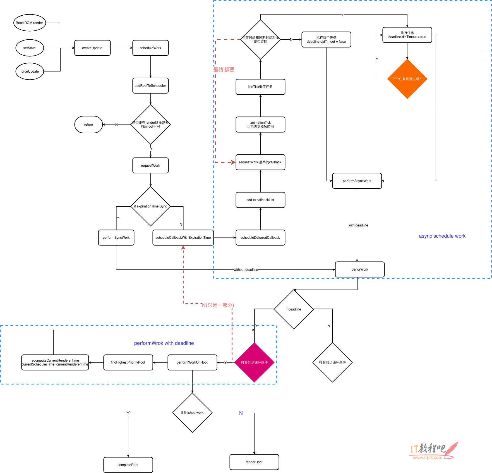
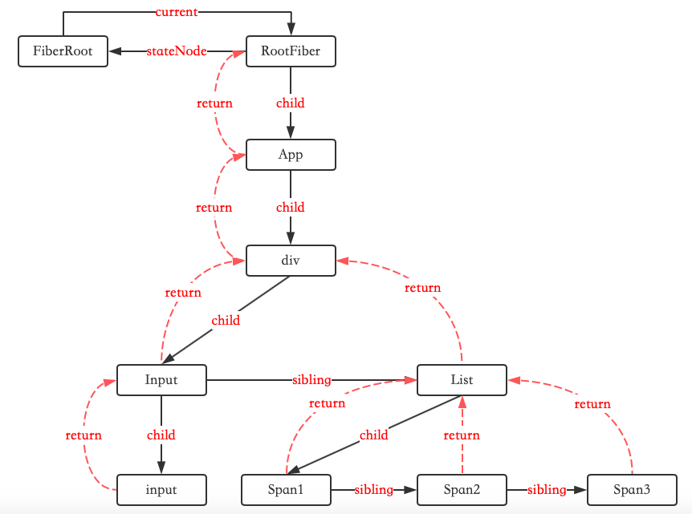
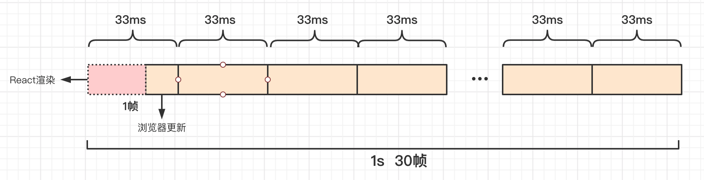
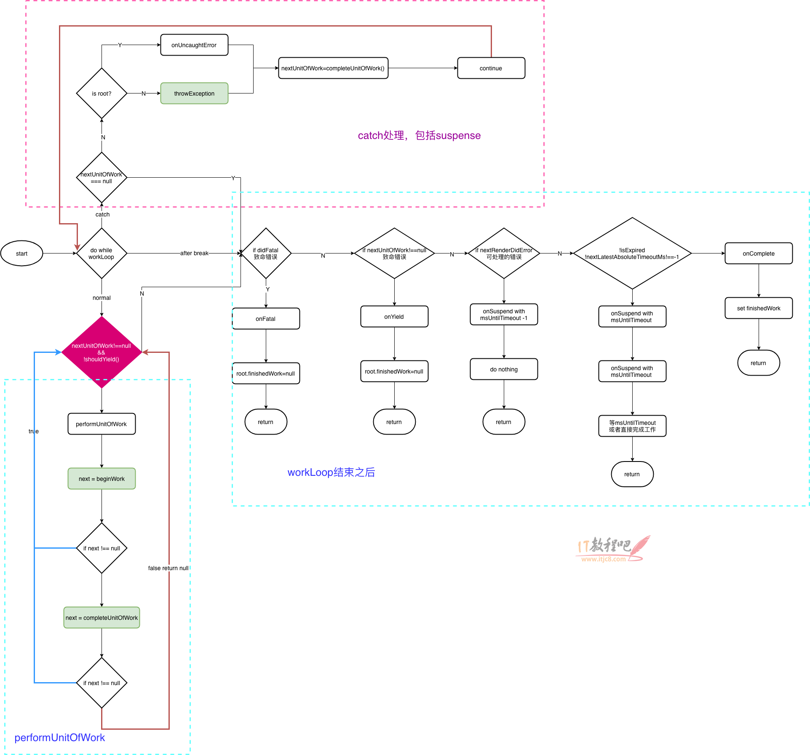

react-code

react源码

##### 参阅地址: https://react.jokcy.me/book/api/react-element.html

- 
  ### 写在前面:
  ##### 1. 重要package:
  
  react, react-dom, event, scheduler, suspense, 
  
  ##### 2. Fiber
  
  Fiber从根本上解决了JS单线程运行如果计算量太大的话导致动画卡帧和交互卡顿的问题
  
  ##### 3. Babel JSX=>JS
  
  Babel会把JSX转化成React.createElement(). 其中第一个参数是字符串或者是大写的变量,第二个参数是由props传递的所有的属性的一个个键值对的对象, 第三个参数是子级.如子级有兄弟节点的话,也会依次转化成第四个,第五个参数,依次类推. 而第一个参数是否为字符串的关键点就在于标签时用大写还是小写.小写代表是原生的html标签(dom节点),大写是代表一个Component (function Component或者是Class Component)
  
  ##### 4. Reserved props 内嵌的props
  
  key, ref, __self, __source
  
  ##### 5. defaultProps
  
  判断依据是这个属性的值是否是undefined

- ### ReactElement和CreateElement的实现过程

```javascript
function createElement(type, config, children) {
  let propName;

  // Reserved names are extracted
  const props = {};

  let key = null;
  let ref = null;
  let self = null;
  let source = null;

  if (config != null) {
    if (hasValidRef(config)) {
      ref = config.ref;

      if (__DEV__) {
        warnIfStringRefCannotBeAutoConverted(config);
      }
    }
    if (hasValidKey(config)) {
      key = '' + config.key;
    }

    self = config.__self === undefined ? null : config.__self;
    source = config.__source === undefined ? null : config.__source;
    // Remaining properties are added to a new props object
    for (propName in config) {
      if (
        hasOwnProperty.call(config, propName) &&
        !RESERVED_PROPS.hasOwnProperty(propName)
      ) {
        props[propName] = config[propName];
      }
    }
  }

  // Children can be more than one argument, and those are transferred onto
  // the newly allocated props object.
  const childrenLength = arguments.length - 2;
  if (childrenLength === 1) {
    props.children = children;
  } else if (childrenLength > 1) {
    const childArray = Array(childrenLength);
    for (let i = 0; i < childrenLength; i++) {
      childArray[i] = arguments[i + 2];
    }
    props.children = childArray;
  }

  // Resolve default props
  if (type && type.defaultProps) {
    const defaultProps = type.defaultProps;
    for (propName in defaultProps) {
      if (props[propName] === undefined) {
        props[propName] = defaultProps[propName];
      }
    }
  }
  return ReactElement(
    type,
    key,
    ref,
    self,
    source,
    ReactCurrentOwner.current,
    props,
  );
}
```

```javascript
const ReactElement = function(type, key, ref, self, source, owner, props) {
    const element = {
        // This tag allows us to uniquely identify this as a React Element
        $$typeof: REACT_ELEMENT_TYPE,

        // Built-in properties that belong on the element
        type: type,
        key: key,
        ref: ref,
        props: props,

        // Record the component responsible for creating this element.
        _owner: owner,
    };
    return element;
};
```

$$typeof 用来标识element是什么类型 REACT_ELEMENT_TYPE或其他

- ### Component和PureComponent

```javascript
function Component(props, context, updater) {
  this.props = props;
  this.context = context;
  // If a component has string refs, we will assign a different object later.
  this.refs = emptyObject;
  // We initialize the default updater but the real one gets injected by the
  // renderer.
  this.updater = updater || ReactNoopUpdateQueue;
}

Component.prototype.setState = function(partialState, callback) {
  invariant(
    typeof partialState === 'object' ||
      typeof partialState === 'function' ||
      partialState == null,
    'setState(...): takes an object of state variables to update or a ' +
      'function which returns an object of state variables.',
  );
  this.updater.enqueueSetState(this, partialState, callback, 'setState');
};
```

PureComponent是继承了Component
```javascript
function ComponentDummy() {}
ComponentDummy.prototype = Component.prototype;

function PureComponent(props, context, updater) {
  this.props = props;
  this.context = context;
  // If a component has string refs, we will assign a different object later.
  this.refs = emptyObject;
  this.updater = updater || ReactNoopUpdateQueue;
}

const pureComponentPrototype = (PureComponent.prototype = new ComponentDummy());
pureComponentPrototype.constructor = PureComponent;
// Avoid an extra prototype jump for these methods.
Object.assign(pureComponentPrototype, Component.prototype);
pureComponentPrototype.isPureReactComponent = true;
```

- ### React Ref

  1. string ref

  2. method ref

  3. **obj ref** . 使用方法: React.createRef();

     ```javascript
     	export function createRef(): RefObject {
        const refObject = {
          current: null,
        };
        return refObject;
      }
     ```

- ### ForwardRef

   适用场景: 在函数组件中(PureComponent), props无法传递ref, 没有实例. 需要forwardRef

   ```javascript
       const Comp = React.forwardRef((props, ref) => {
          return <input type="text" ref={ref} />
       })
   ```

   

    ```javascript
   	 export function forwardRef<Props, ElementType: React$ElementType>(
       render: (props: Props, ref: React$Ref<ElementType>) => React$Node,
        ) {
          const elementType = {
            $$typeof: REACT_FORWARD_REF_TYPE,
            render,
          };
          return elementType;
        }
    ```

​      forwardRef返回的是一个对象,其中$$typeof是REACT_FORWARD_REF_TYPE. 但是组件的类型仍然是  $$typeof是REACT_ELEMENT_TYPE. 只是ReactElement的传值type变成了相应的forward类型.

```javascript
const element = {    
  $$typeof: REACT_ELEMENT_TYPE,    //注意！！！   
  type: {      
    $$typeof: REACT_FORWARD_REF_TYPE,      
    render,    
  },  
};
```

- ### Context

  childContextType(已废弃)

  createContext, useContext

  ```javascript
  const context: ReactContext<T> = {
    $$typeof: REACT_CONTEXT_TYPE,
    _calculateChangedBits: calculateChangedBits,
    _currentValue: defaultValue,
    _currentValue2: defaultValue,
    _threadCount: 0,
    Provider: (null: any),
    Consumer: (null: any),
  };
  ```

- ### ConcurrentMode

  让react的整体渲染过程能够进行优先级的排比并且让整体渲染的过程是能够中断的,可以进行任务的调度,把更多的CPU性能调度给优先级较高的任务, 使得一些耗费大量计算的动画不会渲染的很卡顿.

  <ConcurrentMode></ConcurrentMode>包裹的组件均为低优先级的. 而flushSync会强制执行高优先级的.

- ### Suspense

  1. Suspense包裹的所有组件, 会等待其中所有的promise异步任务均完成, 才会显示包裹的组件,否则展示fallback. 可以支持异步渲染数据
  2. lazy支持异步渲染懒加载组件. 其实在编译的过程中配合webpack生成了一个chunk.js, 其实是code spliting生成出来的.

- ### Memo

  1. 性能优化的点所在. 调用setState会触发组件的重新渲染,无论state是否变化; 父组件更新,子组件也会自动更新.
  2. 在子组件不需要父组件的值和函数的情况下,只需要memo函数; 如果有函数传递给子组件,使用useCallback, 如果是有值传递给子组件使用useMemo.

- ### Others

  1. createFactory: 调用了createElement,并传入的type, 代表什么类型的标签
  2. cloneElement: 其实是创建一个element, 最终是返回ReactElement

- ### ReactDOM.render

  1. 创建更新的三种方式:

     ```javascript
     a. ReactDOM.render || hydrate
     b. setState
     c. forceUpdate
     ```

  2. **legacyRenderSubtreeIntoContainer**(parentComponent, element, containerNode, forceHydrate, callback)

  3. hydrate和render的区别就在于legacyRenderSubtreeIntoContainer的第四个参数forceHydrate是否为true. hydrate是用于服务端渲染的情况下,当客户端第一次渲染的dom节点可以复用的时候,那么可以直接提供给服务端进行渲染,这时候设置为true可以提高性能

  4. createContainer主要是reactReconciler重点, 返回的是createFiberRoot

     > const root = this._internalRoot; 调用的正是createContainer方法, 返回的是一个createFiberRoot. 

     ```javascript
  	  // 代表元素节点
      export const ELEMENT_NODE = 1;
      // 代表文本节点
      export const TEXT_NODE = 3;
      // 代表注释节点
      export const COMMENT_NODE = 8;
      // 代表整个文档，即document
      export const DOCUMENT_NODE = 9;
      // 代表文档片段节点
      export const DOCUMENT_FRAGMENT_NODE = 11;    
     ```

     >根据节点的nodeType是否ElementType和rootElement.hasAttribute(ROOT_ATTRIBUTE_NAME) 其实就是这个属性'data-reactroot'.来判断是否是客户端渲染还是服务端渲染

     ```javascript
     export function createContainer(
        containerInfo: Container,
        tag: RootTag,
        hydrate: boolean,
        hydrationCallbacks: null | SuspenseHydrationCallbacks,
        strictModeLevelOverride: null | number,
      ): OpaqueRoot {
        return createFiberRoot(
          containerInfo,
          tag,
          hydrate,
          hydrationCallbacks,
          strictModeLevelOverride,
        );
      }
     ```

     创建了一个FiberRoot之后, 并在节点上执行updateQueue创建更新队列挂载在fiber.updateQueue下面. 再去根据优先级进行实际的任务的调度更新.

- ### FiberRoot

  是整个应用的起点, 包含应用挂载的的目标节点,记录整个应用更新过程的各种信息

  ```javascript
  function FiberRootNode(containerInfo, tag, hydrate) {
    this.tag = tag;
    this.containerInfo = containerInfo;
    this.pendingChildren = null;
    this.current = null;
    this.pingCache = null;
    this.finishedWork = null;
    this.timeoutHandle = noTimeout;
    this.context = null;
    this.pendingContext = null;
    this.hydrate = hydrate;
    this.callbackNode = null;
    this.callbackPriority = NoLanePriority;
    this.eventTimes = createLaneMap(NoLanes);
    this.expirationTimes = createLaneMap(NoTimestamp);

    this.pendingLanes = NoLanes;
    this.suspendedLanes = NoLanes;
    this.pingedLanes = NoLanes;
    this.expiredLanes = NoLanes;
    this.mutableReadLanes = NoLanes;
    this.finishedLanes = NoLanes;

    this.entangledLanes = NoLanes;
    this.entanglements = createLaneMap(NoLanes);

    if (enableCache) {
      this.pooledCache = null;
      this.pooledCacheLanes = NoLanes;
    }

    if (supportsHydration) {
      this.mutableSourceEagerHydrationData = null;
    }

    if (enableSchedulerTracing) {
      this.interactionThreadID = unstable_getThreadID();
      this.memoizedInteractions = new Set();
      this.pendingInteractionMap = new Map();
    }
    if (enableSuspenseCallback) {
      this.hydrationCallbacks = null;
    }
  }
  ```

- ### Fiber

  1. 每一个ReactElement对应一个Fiber对象. 
  2. 会记录节点的各种状态,包括state和props.对class Component来说每次更新都是挂载在Fiber对象上,并由Fiber去赋值给this. 这样Function Component实现思路也会因此而来,因为Function Component没有this.
  3. 串联整个应用形成树结构: 遍历的过程是深度优先遍历
  ```javascript
  function FiberNode(
    tag: WorkTag,
    pendingProps: mixed,
    key: null | string,
    mode: TypeOfMode,
  ) {
    // Instance
    this.tag = tag;
    this.key = key;
    this.elementType = null;
    this.type = null;
    this.stateNode = null;

    // Fiber
    this.return = null;  // return 是指向自己的父节点
    this.child = null;   // 指向自己的第一个子节点
    this.sibling = null;
    this.index = 0;

    this.ref = null;

    this.pendingProps = pendingProps;
    this.memoizedProps = null;  // 上一次的state
    this.updateQueue = null;    // 新的state
    this.memoizedState = null;
    this.dependencies = null;

    this.mode = mode;

    // Effects
    this.flags = NoFlags;
    this.subtreeFlags = NoFlags;
    this.deletions = null;

    this.lanes = NoLanes;
    this.childLanes = NoLanes;

    this.alternate = null;

    if (enableProfilerTimer) {
      this.actualDuration = Number.NaN;
      this.actualStartTime = Number.NaN;
      this.selfBaseDuration = Number.NaN;
      this.treeBaseDuration = Number.NaN;
      this.actualDuration = 0;
      this.actualStartTime = -1;
      this.selfBaseDuration = 0;
      this.treeBaseDuration = 0;
    }
   }
  ```
  
- ### update和UpdateQueue

  update: 用于记录组件状态的改变, 存放于UpdateQueue中,多个update可以同时存在

  ```javascript
  const update: Update<*> = {
    eventTime,
    lane,

    tag: UpdateState,  // 0|1|2|3
    payload: null,
    callback: null,

    next: null,
  };
  
  export const UpdateState = 0;
  export const ReplaceState = 1;
  export const ForceUpdate = 2;
  export const CaptureUpdate = 3;
  
  export type UpdateQueue<State> = {
    baseState: State,
    firstBaseUpdate: Update<State> | null, // 单向链表的第一个update
    lastBaseUpdate: Update<State> | null,  // 单向链表的最后一个update
    shared: SharedQueue<State>,
    effects: Array<Update<State>> | null,
  };
  ```
  
  执行setState,其实是执行了updater上的enqueueSetState方法:
  
  1. 找到实例上的fiber
  2. 计算得到当前fiber的优先级
  3. 将要更新的fiber推送到更新队列
  4. 根据fiber树上的优先级确定更新工作,从当前fiber的return为起点,开始递归,直到到达根节点,根节点的return为null.
  
- ### ExpirationTime如何计算的?

  以computeAsyncExpiration举例. 

  ```js
  export const LOW_PRIORITY_EXPIRATION = 5000
  export const LOW_PRIORITY_BATCH_SIZE = 250
  ```

  那么计算公式就是: (| 0 是取整的意思)

  >((((currentTime - 2 + 5000 / 10) / 25) | 0) + 1) * 25
  
  expirationTime越小优先级越高, 
  
  1. Sync是代表同步,优先级最高, 不会被调度也不会被打断. 
  
  2. NoWork是0 代表没有更新. 
  3. Async会计算过期时间(InteractiveExpiration是高优先级值更小, AysncExpiration是低优先级值更大). 当setState有回调函数时会走isBatchingInteractiveUpdates为true, 会走InteractiveExpiration高优先级执行
  
  **二进制位运算: & |** 
  
  创建更新的三种方式. 三种方式的执行过程大体相同:
  
  1. ReactDOM.render, 
  
  2. setState(enqueueSetState)
  
  3. forceUpdate(enqueueForceUpdate)
  
  ```javascript
	enqueueSetState(inst, payload, callback) {
	  const fiber = ReactInstanceMap.get(inst);
    const currentTime = requestCurrentTime();
    const expirationTime = computeExpirationForFiber(currentTime, fiber);
  
  const update = createUpdate(expirationTime);
    update.payload = payload;
    if (callback !== undefined && callback !== null) {
      update.callback = callback;
    }
  
  enqueueUpdate(fiber, update);
    scheduleWork(fiber, expirationTime);
  },
  ```

- ### ScheduleWork

  

  
  
   举个简单的例子:
  
  
  点击Button, 去更新List下面的每个span. 其实setState发生在List上. 但是并不是把List节点加入到调度上.而是把这个组件的RootFiber节点加入到调度中
  
  
  
  以下这三点条件(&&且), 就会执行resetStack(). 打断当前的任务,执行更高优先级
  
  1. !isWorking: 没有正在进行渲染的任务
  
  2. nextRenderExpirationTime != noWork: 异步任务正在执行一半的时候没有执行完,要把执行权交给浏览器去执行优先级更高的任务
  
  3. expirationTime < nextRenderExpirationTime: 新的任务的优先级要高于目前做的任务


  以下这三个条件(|| 或),就会执行requestWork().

1. !isWorking: isWorking会包含isCommiting, 是render和commit阶段

2. isCommiting: 正在提交,不可打断的一个阶段. 将Fiber整体渲染的状态出来, 渲染到dom的过程

				3. nextRoot !== root: 上次筛选下拉就要进行更新的root. 单个应用下是都是相等的, 大部分情况下不考虑这个条件


- ### requestWork

  1. 将root加入到调度队列
  2. 判断是否是批量更新
  3. 根据expirationTime判断调度类型

​		scheduleCallbackWithExpirationTime


- ### batchedUpdates

  React17.0.1版本之后的requestWork方法变了,好像是变成了scheduleUpdateOnFiber

  setState是否是异步的? setState本身方法的调用是同步的,但是调用了setState并不标志着react的state会立马就更新了.这个更新是要根据我们当前的执行环境的上下文来判断的.如果处于批量更新的情况下,那么我的state不是当前立马更新的 .而如果我不处于这个批量更新的情况下, 那么就有可能是立马更新的. (concurrentMode异步渲染情况下也不是立马更新的)

  

- ### react scheduler

  维护时间片,模拟requestIdleCallback, 调度列表和超时判断.

  reactScheduler就是为了希望可以留给浏览器刷新动画或者响应用户输入的反馈的时候,每一帧有足够的时间. 不会被react渲染时间太长导致卡顿. 一秒钟至少得至少30帧以上.

  ```javascript
  if (expirationTime === Sync) {
  	performSyncWork();
  } else {
  	scheduleCallbackWithExpirationTime(root, expirationTime);
  }
  ```
  
  unstable_scheduleCallback.
  
  要保证1s内至少有30帧.那么1帧就是33毫秒. 而这33毫秒中要有固定的浏览器渲染的时间,而剩下的就是react的执行时间.如果一个react时间片渲染不完,就会被打断,先把调度权给浏览器, 执行更高优先级的,而后等浏览器空闲的再接着根据优先级的顺序执行react渲染.
  
  如何模拟requestIdleCallback? 
  


- ### performWork

  是否有deadline的区分, 循环渲染Root的条件, 超过时间片的处理.

  ```javascript
  function performWork(minExpirationTime: ExpirationTime, dl: Deadline | null) {
  deadline = dl;

  findHighestPriorityRoot();

  if (deadline !== null) {
    recomputeCurrentRendererTime();
    currentSchedulerTime = currentRendererTime;

    if (enableUserTimingAPI) {
      const didExpire = nextFlushedExpirationTime < currentRendererTime;
      const timeout = expirationTimeToMs(nextFlushedExpirationTime);
      stopRequestCallbackTimer(didExpire, timeout);
    }

    while (
      nextFlushedRoot !== null &&
      nextFlushedExpirationTime !== NoWork &&
      (minExpirationTime === NoWork ||
        minExpirationTime >= nextFlushedExpirationTime) &&
      (!deadlineDidExpire || currentRendererTime >= nextFlushedExpirationTime)
    ) {
      performWorkOnRoot(
        nextFlushedRoot,
        nextFlushedExpirationTime,
        currentRendererTime >= nextFlushedExpirationTime,
      );
      findHighestPriorityRoot();
      recomputeCurrentRendererTime();
      currentSchedulerTime = currentRendererTime;
    }
  } else {
    while (
      nextFlushedRoot !== null &&
      nextFlushedExpirationTime !== NoWork &&
      (minExpirationTime === NoWork ||
        minExpirationTime >= nextFlushedExpirationTime)
    ) {
      performWorkOnRoot(nextFlushedRoot, nextFlushedExpirationTime, true);
      findHighestPriorityRoot();
    }
  }

  if (deadline !== null) {
    callbackExpirationTime = NoWork;
    callbackID = null;
  }
  if (nextFlushedExpirationTime !== NoWork) {
    scheduleCallbackWithExpirationTime(
      ((nextFlushedRoot: any): FiberRoot),
      nextFlushedExpirationTime,
    );
  }

  deadline = null;
  deadlineDidExpire = false;

  finishRendering();
}
  ```
  
- ### renderRoot

  调用workloop进行循环单元更新, 捕获错误并进行处理, 走完流程之后进行善后

  
  
  isYieldy: 是否可以被中断.只有Sync的任务或者已经超时的异步任务是不允许被中断的.
  
  currentTime: 在一次渲染中产生的更新需要使用相同的时间; 一次批处理的更新应该得到相同的时间; 挂起任务用于记录的时候应该相同
  
  ```javascript
  function requestCurrentTime() {
  if (isRendering) {
    return currentSchedulerTime;
  }
  findHighestPriorityRoot();
  if (
    nextFlushedExpirationTime === NoWork ||
    nextFlushedExpirationTime === Never
  ) {
    recomputeCurrentRendererTime();
    currentSchedulerTime = currentRendererTime;
    return currentSchedulerTime;
  }
  return currentSchedulerTime;
}
  ```
  
  如果是batchedUpdates情况下,这个if判断if (
    nextFlushedExpirationTime === NoWork ||
    nextFlushedExpirationTime === Never
  ), 就避免了三次更新都需要重新计算requestCurrentTime的问题, 就不需要分批次进行更新.